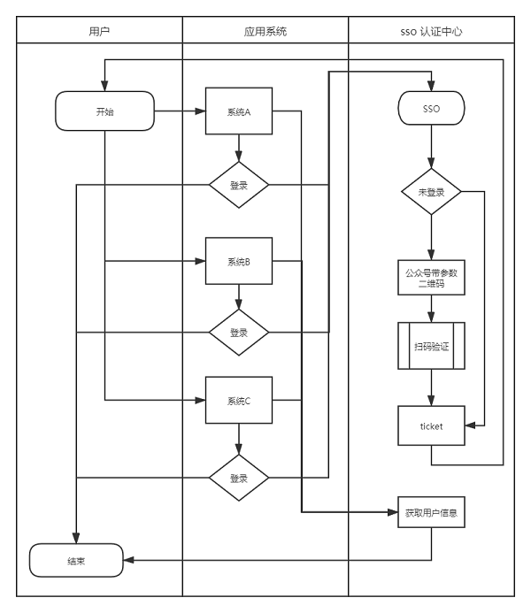

# 微信扫码关注公众号并登录网站

## 修改配置

复制一个配置文件

```
cp .env.example .env
```

并修改对应的配置

## 导入数据表

```cli
php artisan migration
```

## 流程图



## 应用接入示例

* 第一步

应用判断登录，跳转（或弹框）至登录页 https://sso.lingyin99.com/?redirect_uri=https://www.baidu.com  

redirect_uri 为回调页面，为了避免不必要的问题，应该对其做 urlencode 编码

* 第二步

sso 验证扫码成功后，会回调至 redirect_uri , 并会带回一个 code。  

应用接收到 code 后，请求接口 https://sso.lingyin99.com/user-info?code=xxxxx ,获取回用户信息。

种上登录态，该干啥就干啥了
